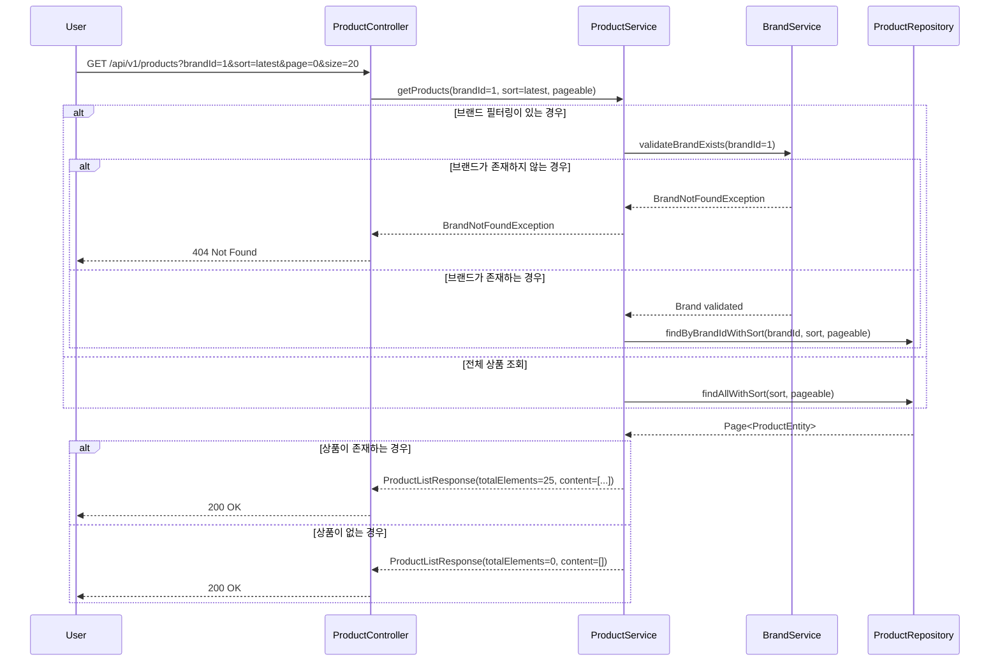
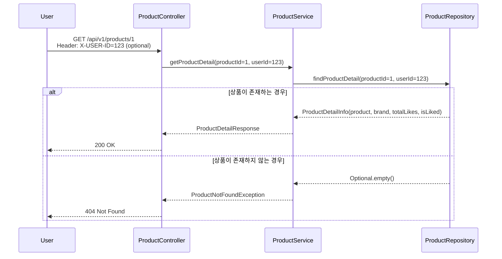
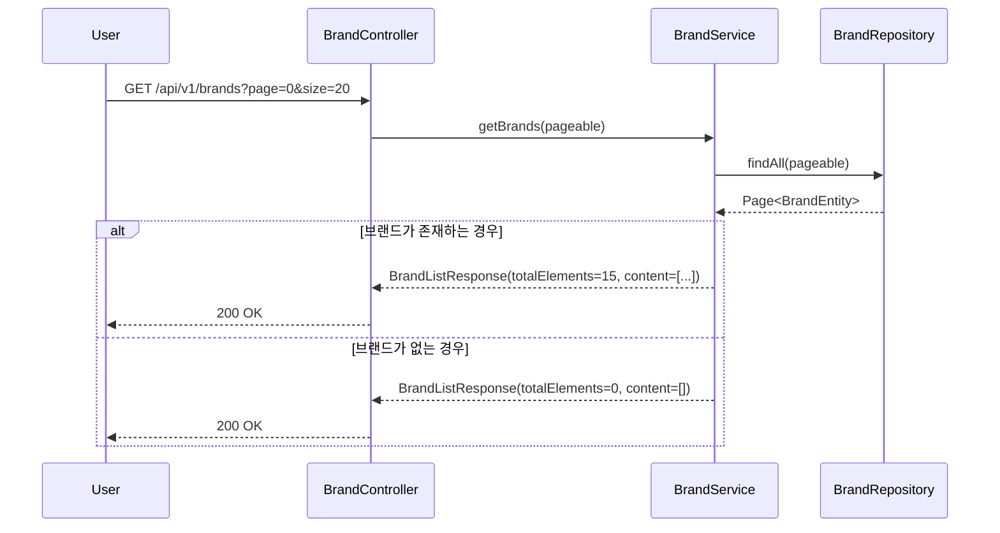
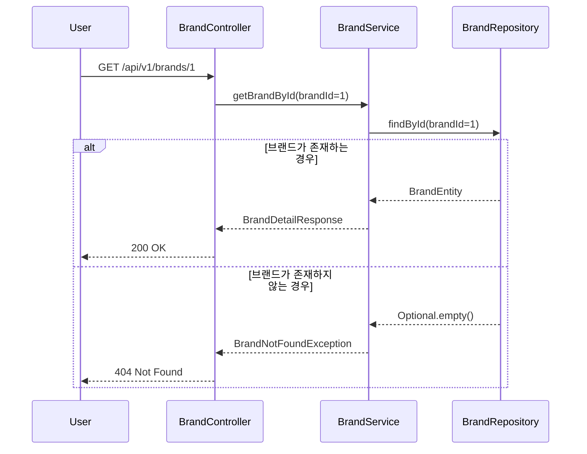
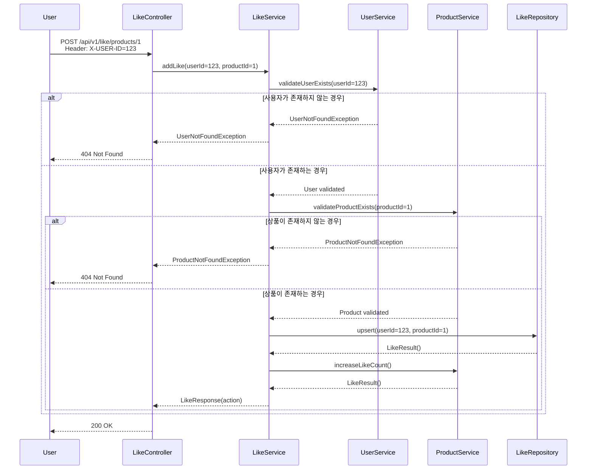
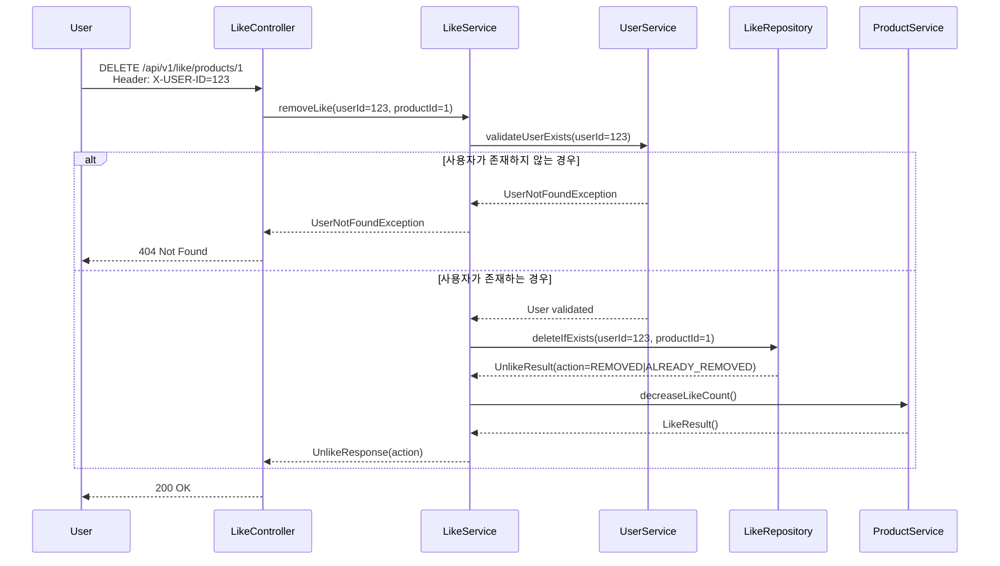
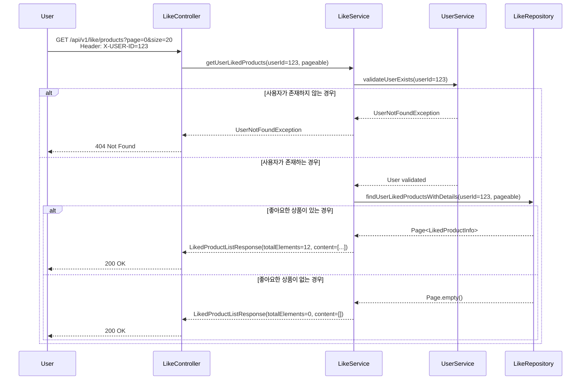
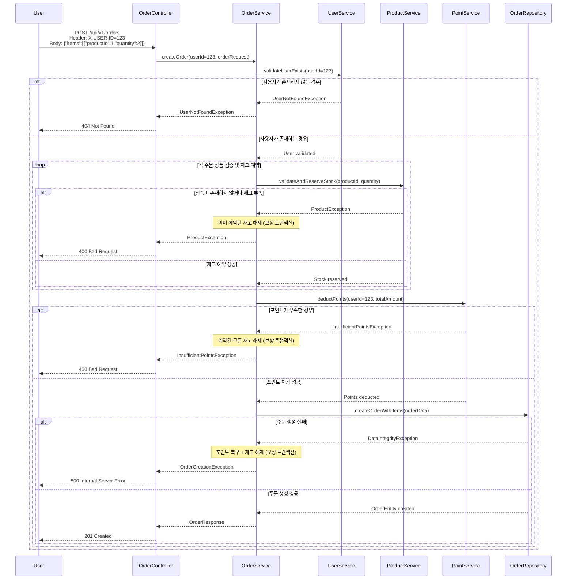
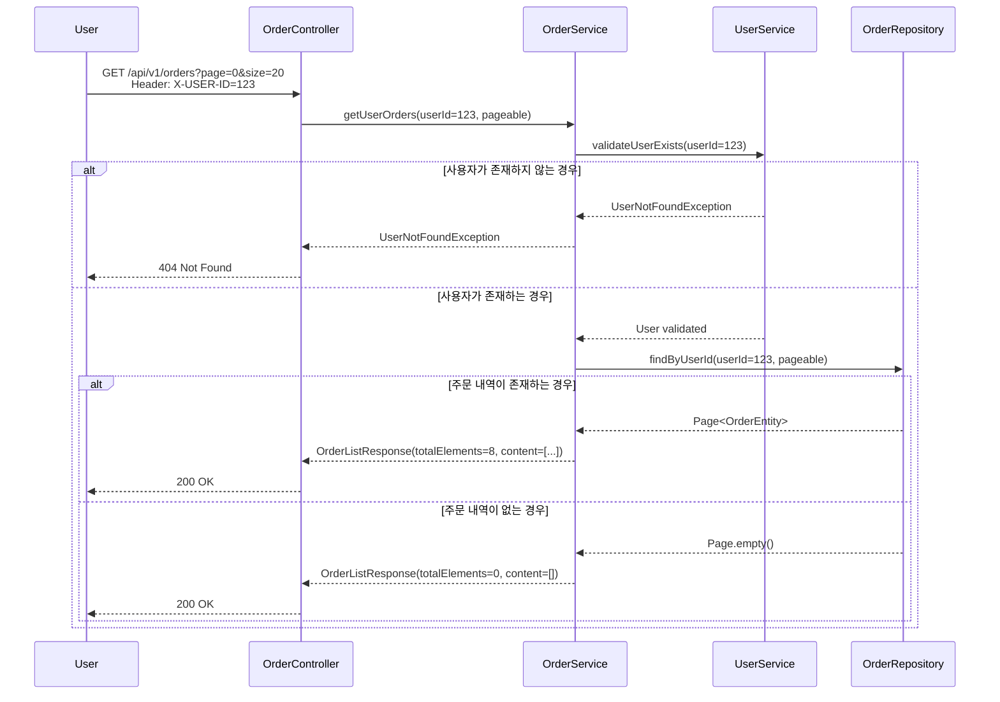
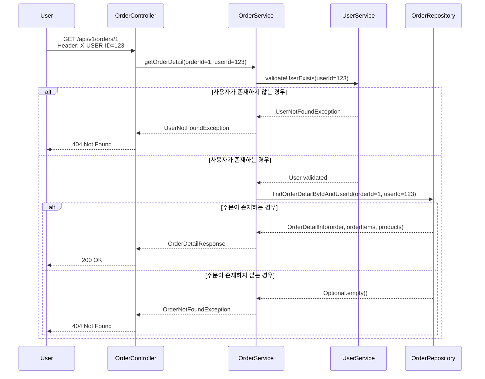

# 🔄 02. 시퀀스 다이어그램

## 1. 상품 목록 조회

## 2. 상품 상세 조회

## 3. 브랜드 목록 조회

## 4. 브랜드 상세 조회

## 5. 좋아요 등록

## 6. 좋아요 취소

## 7. 내가 좋아요한 상품 목록 조회

## 8. 주문 요청

### 🔒 주문 처리 원자성 보장

#### **트랜잭션 전략**
- **보상 트랜잭션**: 실패 시점에 따른 롤백 전략
  - 재고 예약 실패 → 이미 예약된 재고 즉시 해제
  - 포인트 차감 실패 → 예약된 모든 재고 해제  
  - 주문 생성 실패 → 포인트 복구 + 재고 해제

## 9. 사용자의 주문 목록 조회

## 10. 주문 상세 조회

