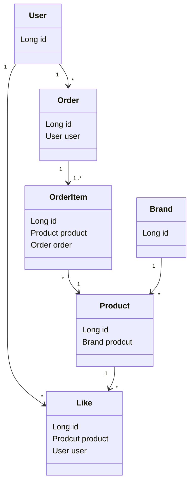
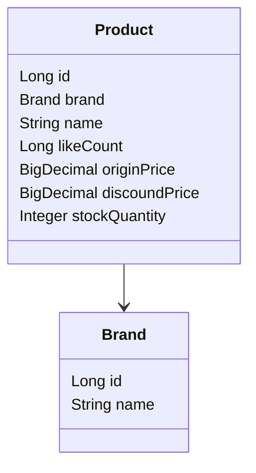
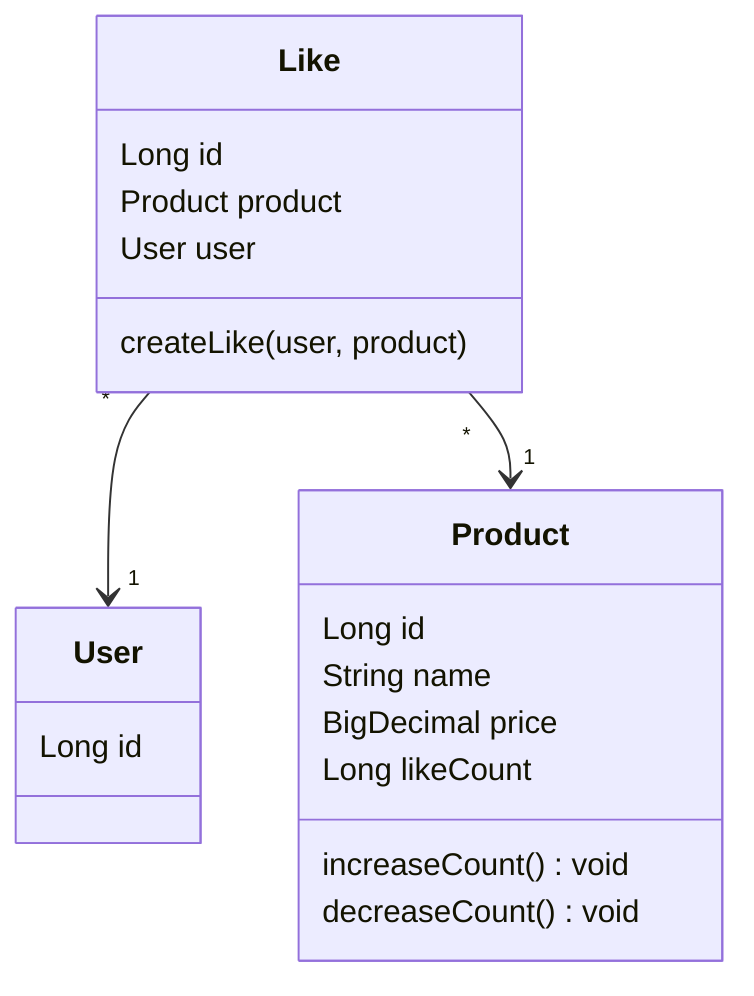
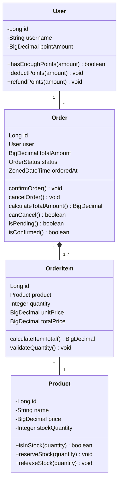

# 03. 클래스 다이어그램

## 도메인 모델 개요

이커머스 서비스의 핵심 도메인 객체들과 그들 간의 관계입니다.
---
## 주요 도메인 규칙

### 비즈니스 제약사항

| 도메인 | 핵심 규칙 |
|--------|-----------|
| **User** | 포인트는 음수 불가, 차감 시 잔액 검증 |
| **Product** | 재고는 음수 불가, 예약 시 가용 수량 검증 |
| **Order** | 재고 예약과 포인트 차감은 원자적 처리 |
| **Like** | 사용자당 상품별 1개만 가능, 멱등성 보장 |

### 도메인 관계 요약

| 관계                   | 설명                | 다중성 | 비고 |
|----------------------|-------------------|-----|------|
| Product -> Brand     | 상품은 브랜드에 속함       | N:1 | 필수 관계 |
| Like -> User         | 좋아요는 사용자가 생성      | N:1 | 필수 관계 |
| Like -> Product      | 좋아요는 상품에 대한 것     | N:1 | 필수 관계 |
| Order -> User        | 주문은 사용자가 생성       | N:1 | 필수 관계 |
| OrderItem -> Order   | 주문 상세내역은 주문 정보 포함 | N:1 | 필수 관계 |
| OrderItem -> Product | 주문항목은 상품을 참조      | N:1 | 필수 관계 |

---
## 도메인 클래스 다이어그램

### 전체 도메인 모델

---

## 도메인별 상세 다이어그램

### 상품 도메인 (Product Domain)

### 사용자 & 좋아요 도메인 (User & Like Domain)

### 주문 도메인 (Order Domain)

