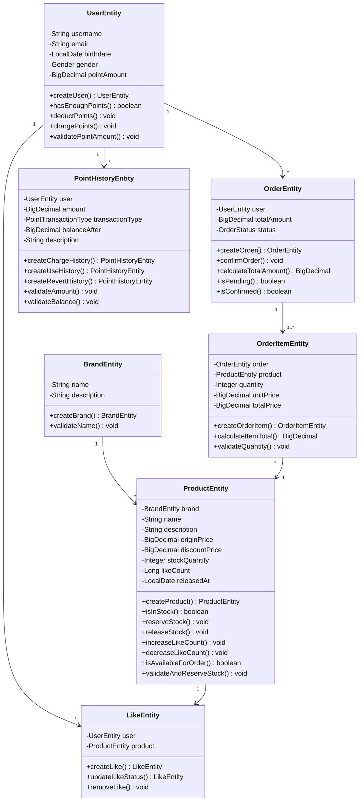
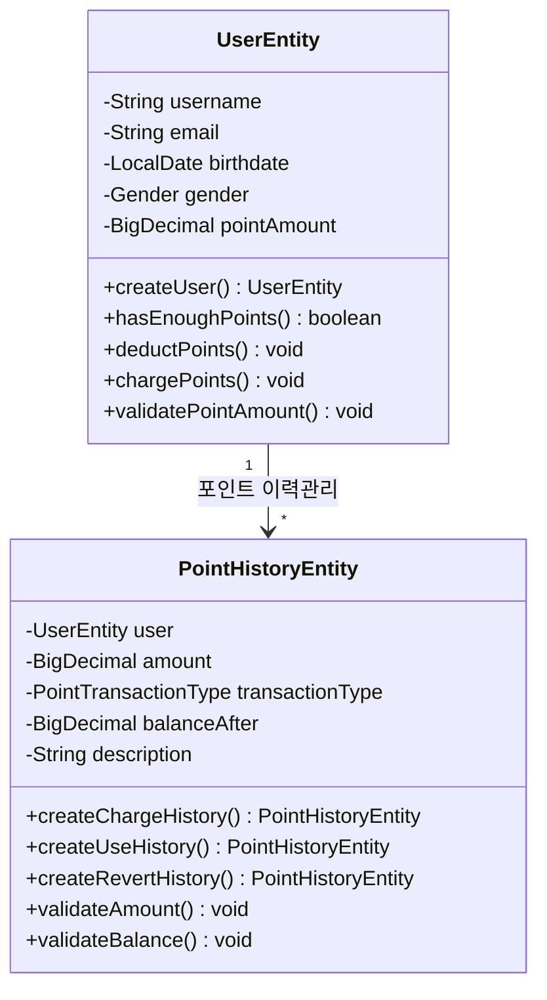
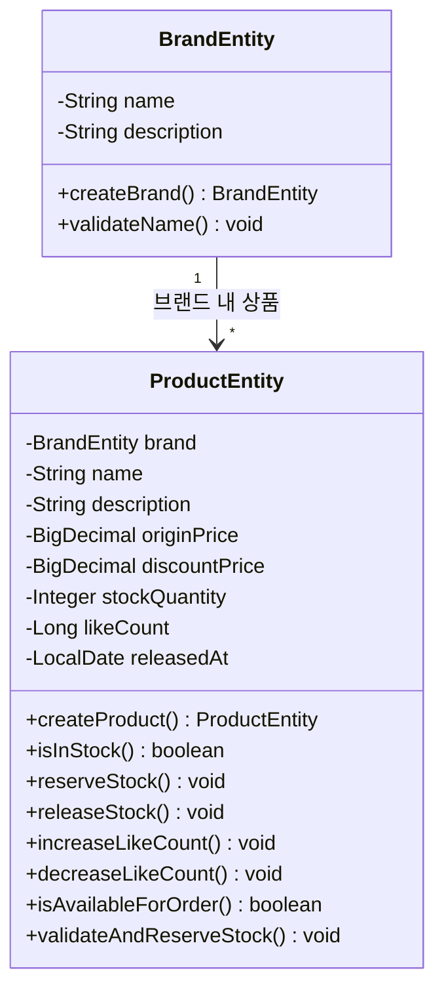
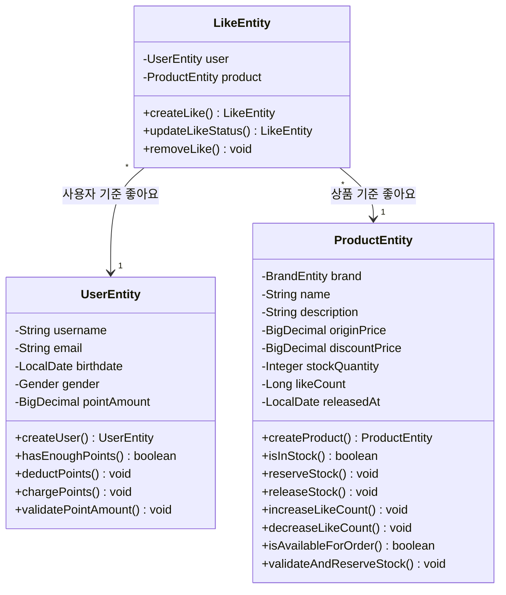
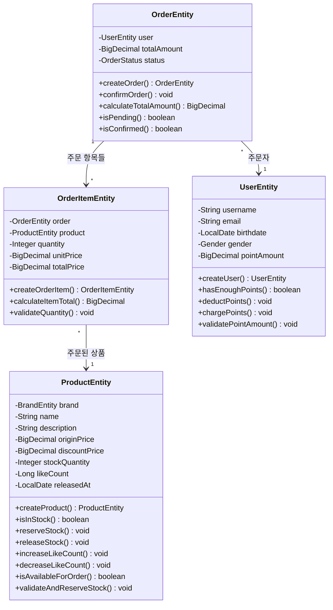

# 03. 클래스 다이어그램

## 도메인 모델 개요

이커머스 서비스의 핵심 도메인 객체들과 그들 간의 관계를 정의합니다.
DDD 기반 레이어드 아키텍처를 따르며, BaseEntity를 상속한 엔티티 설계를 적용합니다.

---

## 주요 도메인 규칙

### 비즈니스 제약사항

| 도메인 | 핵심 규칙 |
|--------|-----------|
| **User** | 포인트는 음수 불가, 차감 시 잔액 검증 필수 |
| **Product** | 재고는 음수 불가, 예약 시 가용 수량 검증 필수 |
| **Order** | 재고 예약과 포인트 차감은 원자적 처리 |
| **Like** | 사용자당 상품별 1개만 가능, 멱등성 보장 |
| **Brand** | 브랜드명 중복 불가, 소프트 삭제 지원 |

### 도메인 관계 요약

| 관계                   | 설명                | 다중성 | 비고 |
|----------------------|-------------------|-----|------|
| Product -> Brand     | 상품은 브랜드에 속함       | N:1 | 필수 관계 |
| Like -> User         | 좋아요는 사용자가 생성      | N:1 | 필수 관계 |
| Like -> Product      | 좋아요는 상품에 대한 것     | N:1 | 필수 관계 |
| Order -> User        | 주문은 사용자가 생성       | N:1 | 필수 관계 |
| OrderItem -> Order   | 주문 상세내역은 주문 정보 포함 | N:1 | 필수 관계 |
| OrderItem -> Product | 주문항목은 상품을 참조      | N:1 | 필수 관계 |
| PointHistory -> User | 포인트 이력은 사용자별 관리  | N:1 | 필수 관계 |

---

## 전체 도메인 모델

---

## 도메인별 상세 다이어그램

### 1. 사용자 도메인 (User Domain)

### 2. 상품 도메인 (Product Domain)

### 3. 좋아요 도메인 (Like Domain)

### 4. 주문 도메인 (Order Domain)

---

## 도메인 엔티티 핵심 책임

### 1. UserEntity - 사용자 도메인의 핵심 책임

| 메서드 | 책임       | 비즈니스 규칙                  | 구현 세부사항 |
|--------|----------|--------------------------|---------------|
| `createUser()` | 사용자 생성   | 사용자명/이메일 유효성 검증, 성인 여부 확인 | 정적 팩토리 메서드, 불변 객체 생성 |
| `hasEnoughPoints()` | 포인트 잔액 확인 | 요청 금액과 보유 포인트 비교         | 음수 방지, BigDecimal 정밀 계산 |
| `deductPoints()` | 포인트 차감   | 잔액 부족 시 예외 발생, 음수 방지     | 원자적 연산, 상태 변경 후 검증 |
| `chargePoints()` | 포인트 충전   | 충전 금액 양수 검증, 최대 한도 확인    | 충전 한도 비즈니스 규칙 적용 |
| `validatePointAmount()` | 포인트 검증   | 현재 포인트를 사용 가능하도록 유효성  검증 | 유효성 검사 로직 포함 |

### 2. ProductEntity - 상품 도메인의 핵심 책임

| 메서드 | 책임 | 비즈니스 규칙 | 구현 세부사항 |
|--------|------|---------------|---------------|
| `createProduct()` | 상품 생성 | 가격 유효성, 재고 음수 방지, 브랜드 연관 | 정적 팩토리 메서드, 브랜드 필수 검증 |
| `isInStock()` | 재고 확인 | 요청 수량과 가용 재고 비교 | 동시성 고려한 재고 체크 |
| `reserveStock()` | 재고 예약 | 가용 재고 확인 후 차감 | 낙관적 락 또는 비관적 락 적용 |
| `releaseStock()` | 재고 복구 | 예약 취소 시 재고 복원 | 재고 복구 시 최대값 검증 |
| `increaseLikeCount()` | 좋아요 수 증가 | 음수 방지, 동시성 제어 | 원자적 증가 연산 |
| `decreaseLikeCount()` | 좋아요 수 감소 | 0 이하로 감소 방지 | 최소값 0 보장 |
| `isAvailableForOrder()` | 주문 가능 여부 | 재고 존재, 삭제되지 않음 | 복합 조건 검증 |
| `validateAndReserveStock()` | 재고 검증 및 예약 | 재고 부족 시 예외, 동시성 제어 | 원자적 재고 예약 처리 |

### 3. OrderEntity - 주문 도메인의 핵심 책임

| 메서드 | 책임 | 비즈니스 규칙 | 구현 세부사항 |
|--------|------|---------------|---------------|
| `createOrder()` | 주문 생성 | 사용자 검증, 주문 항목 유효성 | 정적 팩토리 메서드, 복합 검증 |
| `confirmOrder()` | 주문 확정 | PENDING → CONFIRMED 상태 전이 | 상태 전이 규칙 검증 |
| `calculateTotalAmount()` | 총액 계산 | 주문 항목별 금액 합계 | BigDecimal 정밀 계산 |
| `isPending()` | 대기 상태 확인 | 주문 상태가 PENDING인지 확인 | 상태 검증 메서드 |
| `isConfirmed()` | 확정 상태 확인 | 주문 상태가 CONFIRMED인지 확인 | 상태 검증 메서드 |

### 4. OrderItemEntity - 주문 항목 도메인의 핵심 책임

| 메서드 | 책임 | 비즈니스 규칙 | 구현 세부사항 |
|--------|------|---------------|---------------|
| `createOrderItem()` | 주문 항목 생성 | 상품 존재, 수량 양수, 가격 유효성 | 정적 팩토리 메서드, 스냅샷 가격 |
| `calculateItemTotal()` | 항목 총액 계산 | 단가 × 수량 = 총액 | BigDecimal 정밀 계산 |
| `validateQuantity()` | 수량 검증 | 수량 1 이상, 최대 수량 제한 | 수량 범위 검증 |

### 5. LikeEntity - 좋아요 도메인의 핵심 책임

| 메서드                   | 책임          | 비즈니스 규칙                 | 구현 세부사항           |
|-----------------------|-------------|-------------------------|-------------------|
| `createLike()`        | 좋아요 생성      | 사용자-상품 조합 유일성, 멱등성 보장   | 정적 팩토리 메서드, 복합키 검증 |
| `updateLikeStatus()`  | 좋아요 상태 업데이트 | 기존 사용자 좋아요 상태 활성화       | 변경 전 , 변경후 상태 검증  |
| `removeLike()`        | 좋아요 삭제      | 소프트 삭제, isDeleted 플래그 설정 | 물리적 삭제 대신 논리적 삭제 |

### 6. BrandEntity - 브랜드 도메인의 핵심 책임

| 메서드 | 책임 | 비즈니스 규칙 | 구현 세부사항 |
|--------|------|---------------|---------------|
| `createBrand()` | 브랜드 생성 | 브랜드명 중복 방지, 필수값 검증 | 정적 팩토리 메서드, 유니크 제약 |
| `validateName()` | 브랜드명 검증 | 브랜드명 형식, 길이, 중복 검증 | 브랜드명 유효성 규칙 |

### 7. PointHistoryEntity - 포인트 이력 도메인의 핵심 책임

| 메서드 | 책임 | 비즈니스 규칙 | 구현 세부사항 |
|--------|------|---------------|---------------|
| `createChargeHistory()` | 충전 이력 생성 | 충전 금액 양수, 잔액 일치성 | 정적 팩토리 메서드, 충전 타입 |
| `createUseHistory()` | 사용 이력 생성 | 사용 금액 양수, 잔액 일치성 | 정적 팩토리 메서드, 사용 타입 |
| `createRevertHistory()` | 복구 이력 생성 | 복구 금액 양수, 잔액 일치성 | 정적 팩토리 메서드, 복구 타입 |
| `validateAmount()` | 금액 검증 | 금액 양수, 범위 검증 | 금액 유효성 규칙 |
| `validateBalance()` | 잔액 검증 | 거래 후 잔액 음수 방지 | 잔액 일치성 검증 |

---