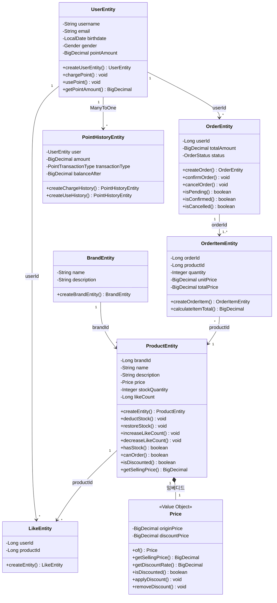
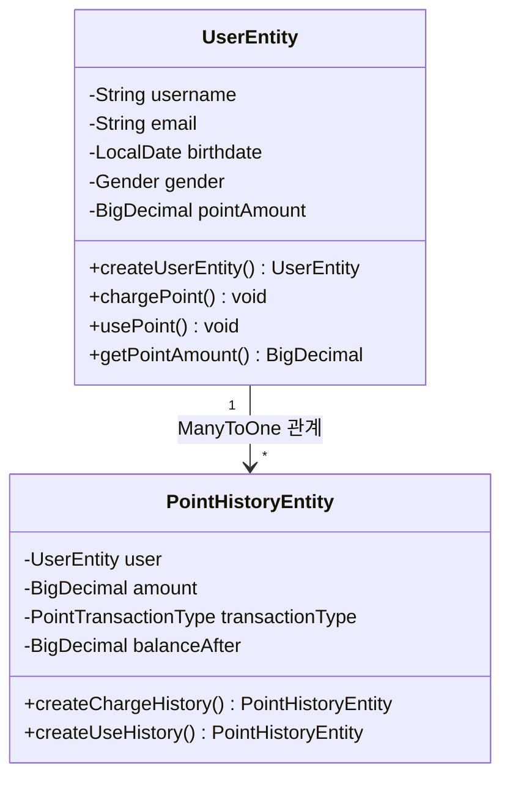
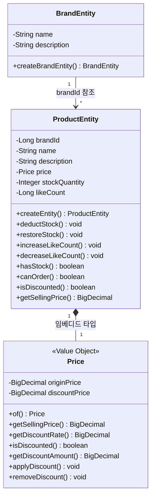
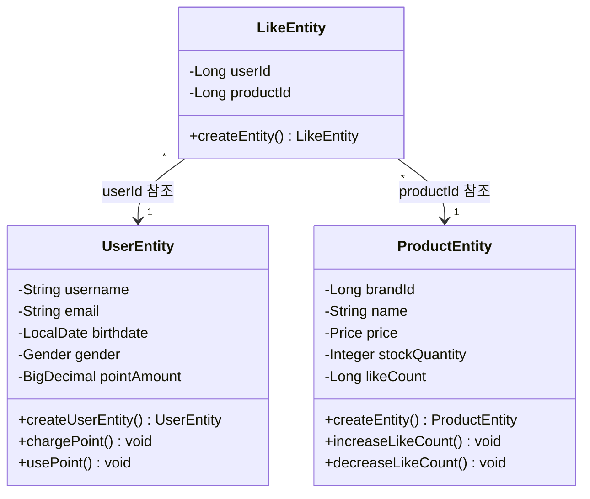
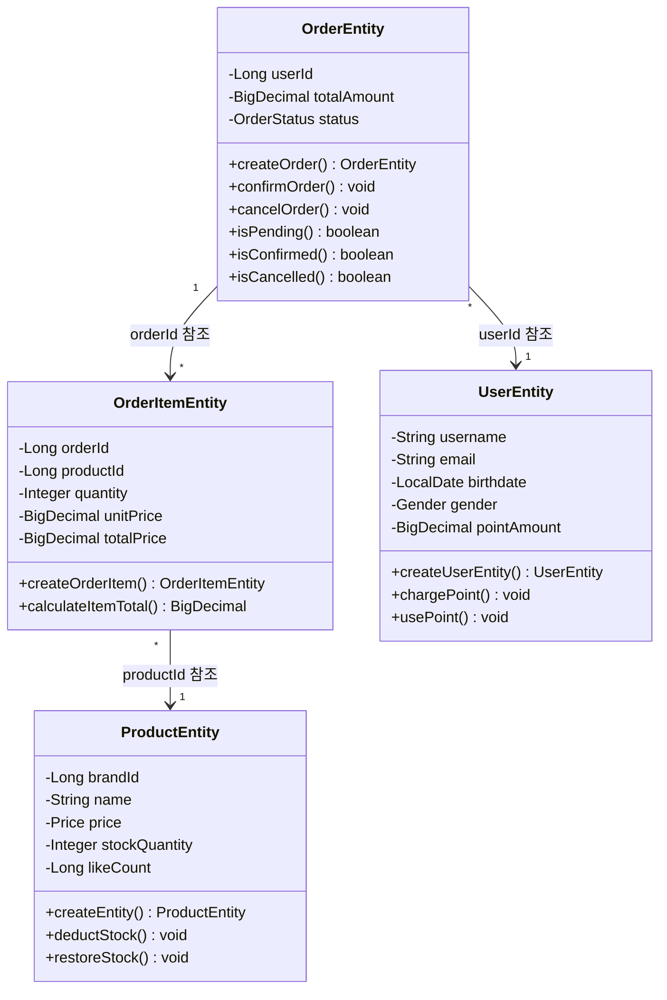

# 03. 클래스 다이어그램

## 도메인 모델 개요

이커머스 서비스의 핵심 도메인 객체들과 그들 간의 관계를 정의합니다.
DDD 기반 레이어드 아키텍처를 따르며, BaseEntity를 상속한 엔티티 설계를 적용합니다.

---

## 주요 도메인 규칙

### 비즈니스 제약사항

| 도메인 | 핵심 규칙 |
|--------|-----------|
| **User** | 포인트는 음수 불가, 차감 시 잔액 검증 필수 |
| **Product** | 재고는 음수 불가, 예약 시 가용 수량 검증 필수 |
| **Order** | 재고 예약과 포인트 차감은 원자적 처리 |
| **Like** | 사용자당 상품별 1개만 가능, 멱등성 보장 |
| **Brand** | 브랜드명 중복 불가, 소프트 삭제 지원 |

### 도메인 관계 요약

| 관계                   | 설명                | 다중성 | 비고 |
|----------------------|-------------------|-----|------|
| Product -> Brand     | 상품은 브랜드에 속함       | N:1 | 필수 관계 |
| Like -> User         | 좋아요는 사용자가 생성      | N:1 | 필수 관계 |
| Like -> Product      | 좋아요는 상품에 대한 것     | N:1 | 필수 관계 |
| Order -> User        | 주문은 사용자가 생성       | N:1 | 필수 관계 |
| OrderItem -> Order   | 주문 상세내역은 주문 정보 포함 | N:1 | 필수 관계 |
| OrderItem -> Product | 주문항목은 상품을 참조      | N:1 | 필수 관계 |
| PointHistory -> User | 포인트 이력은 사용자별 관리  | N:1 | 필수 관계 |

---

## 전체 도메인 모델

---

## 도메인별 상세 다이어그램

### 1. 사용자 도메인 (User Domain)

### 2. 상품 도메인 (Product Domain)

### 3. 좋아요 도메인 (Like Domain)

### 4. 주문 도메인 (Order Domain)

---

## 도메인 엔티티 핵심 책임

### 1. UserEntity - 사용자 도메인의 핵심 책임

| 메서드 | 책임       | 비즈니스 규칙                  | 구현 세부사항 |
|--------|----------|--------------------------|---------------|
| `createUserEntity()` | 사용자 생성   | 사용자명/이메일 유효성 검증, 생년월일 검증 | 정적 팩토리 메서드, 불변 객체 생성 |
| `chargePoint()` | 포인트 충전   | 충전 금액 양수 검증    | BigDecimal 정밀 계산, 원자적 연산 |
| `usePoint()` | 포인트 사용   | 잔액 부족 시 예외 발생, 음수 방지     | 원자적 연산, 상태 변경 후 검증 |
| `getPointAmount()` | 포인트 조회   | 소수점 2자리로 반올림    | RoundingMode.HALF_UP 적용 |

### 2. ProductEntity - 상품 도메인의 핵심 책임

| 메서드 | 책임 | 비즈니스 규칙 | 구현 세부사항 |
|--------|------|---------------|---------------|
| `createEntity()` | 상품 생성 | 가격 유효성, 재고 음수 방지, 브랜드 ID 필수 | 정적 팩토리 메서드, Price 임베디드 타입 |
| `hasStock()` | 재고 확인 | 재고 수량 > 0 | 단순 재고 존재 여부 확인 |
| `canOrder()` | 주문 가능 여부 | 재고 >= 수량, 수량 > 0 | 복합 조건 검증 |
| `deductStock()` | 재고 차감 | 재고 부족 시 INSUFFICIENT_STOCK 예외 | 원자적 재고 차감 연산 |
| `restoreStock()` | 재고 복구 | 취소 시 재고 복원 | 재고 복구 연산 |
| `increaseLikeCount()` | 좋아요 수 증가 | 음수 방지, 동시성 제어 | 원자적 증가 연산 |
| `decreaseLikeCount()` | 좋아요 수 감소 | 0 이하로 감소 방지 | 최소값 0 보장 |
| `isDiscounted()` | 할인 여부 | Price 객체의 할인가 존재 여부 | Price.isDiscounted() 위임 |
| `getSellingPrice()` | 판매가 조회 | 할인가 우선, 없으면 정가 | Price.getSellingPrice() 위임 |

### 3. OrderEntity - 주문 도메인의 핵심 책임

| 메서드 | 책임 | 비즈니스 규칙 | 구현 세부사항 |
|--------|------|---------------|---------------|
| `createOrder()` | 주문 생성 | 사용자 ID 필수, 총액 > 0 | 정적 팩토리 메서드, 초기 상태 PENDING |
| `confirmOrder()` | 주문 확정 | PENDING → CONFIRMED 상태 전이 | INVALID_ORDER_STATUS 예외 처리 |
| `cancelOrder()` | 주문 취소 | PENDING/CONFIRMED → CANCELLED | 취소 가능 상태 검증 |
| `isPending()` | 대기 상태 확인 | 주문 상태가 PENDING인지 확인 | 상태 검증 메서드 |
| `isConfirmed()` | 확정 상태 확인 | 주문 상태가 CONFIRMED인지 확인 | 상태 검증 메서드 |
| `isCancelled()` | 취소 상태 확인 | 주문 상태가 CANCELLED인지 확인 | 상태 검증 메서드 |

### 4. OrderItemEntity - 주문 항목 도메인의 핵심 책임

| 메서드 | 책임 | 비즈니스 규칙 | 구현 세부사항 |
|--------|------|---------------|---------------|
| `createOrderItem()` | 주문 항목 생성 | 주문 ID, 상품 ID 필수, 수량 >= 1, 단가 > 0 | 정적 팩토리 메서드, 스냅샷 가격 |
| `calculateItemTotal()` | 항목 총액 계산 | 단가 × 수량 = 총액 | BigDecimal 정밀 계산 |

### 5. LikeEntity - 좋아요 도메인의 핵심 책임

| 메서드                   | 책임          | 비즈니스 규칙                 | 구현 세부사항           |
|-----------------------|-------------|-------------------------|-------------------|
| `createEntity()`        | 좋아요 생성      | 사용자 ID, 상품 ID 필수, 복합 유니크 제약   | 정적 팩토리 메서드, 복합키 검증 |

### 6. BrandEntity - 브랜드 도메인의 핵심 책임

| 메서드 | 책임 | 비즈니스 규칙 | 구현 세부사항 |
|--------|------|---------------|---------------|
| `createBrandEntity()` | 브랜드 생성 | 브랜드명 필수, 설명 선택사항, 길이 <= 100 | 정적 팩토리 메서드, 유니크 제약 |

### 7. PointHistoryEntity - 포인트 이력 도메인의 핵심 책임

| 메서드 | 책임 | 비즈니스 규칙 | 구현 세부사항 |
|--------|------|---------------|---------------|
| `createChargeHistory()` | 충전 이력 생성 | 충전 금액 양수, 잔액 일치성 | 정적 팩토리 메서드, CHARGE 타입 |
| `createUseHistory()` | 사용 이력 생성 | 사용 금액 양수, 잔액 일치성 | 정적 팩토리 메서드, USE 타입 |

### 8. Price - 가격 임베디드 타입의 핵심 책임

| 메서드 | 책임 | 비즈니스 규칙 | 구현 세부사항 |
|--------|------|---------------|---------------|
| `of()` | Price 객체 생성 | 정가 필수, 할인가 선택사항 | 정적 팩토리 메서드, 불변 객체 |
| `ofOriginOnly()` | 정가만으로 생성 | 정가 > 0 | 할인가 없는 Price 생성 |
| `getSellingPrice()` | 실제 판매가 반환 | 할인가 우선, 없으면 정가 | 할인가 존재 여부에 따른 분기 |
| `getDiscountRate()` | 할인율 계산 | (정가-할인가)/정가 * 100 | BigDecimal 정밀 계산, 소수점 2자리 |
| `isDiscounted()` | 할인 여부 확인 | 할인가가 null이 아니고 정가보다 작음 | 할인가 유효성 검증 |
| `getDiscountAmount()` | 할인 금액 계산 | 정가 - 할인가 | 할인 절약 금액 반환 |
| `applyDiscount()` | 할인 적용 | 할인가 >= 0, 할인가 <= 정가 | 할인가 유효성 검증 후 적용 |
| `removeDiscount()` | 할인 제거 | 할인가를 null로 설정 | 할인 정보 초기화 |

---