# 🔄 02. 시퀀스 다이어그램

## 1. 상품 목록 조회

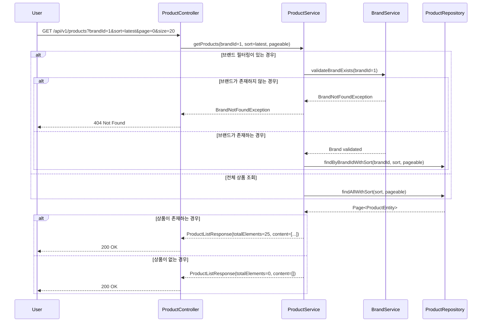

## 2. 상품 상세 조회

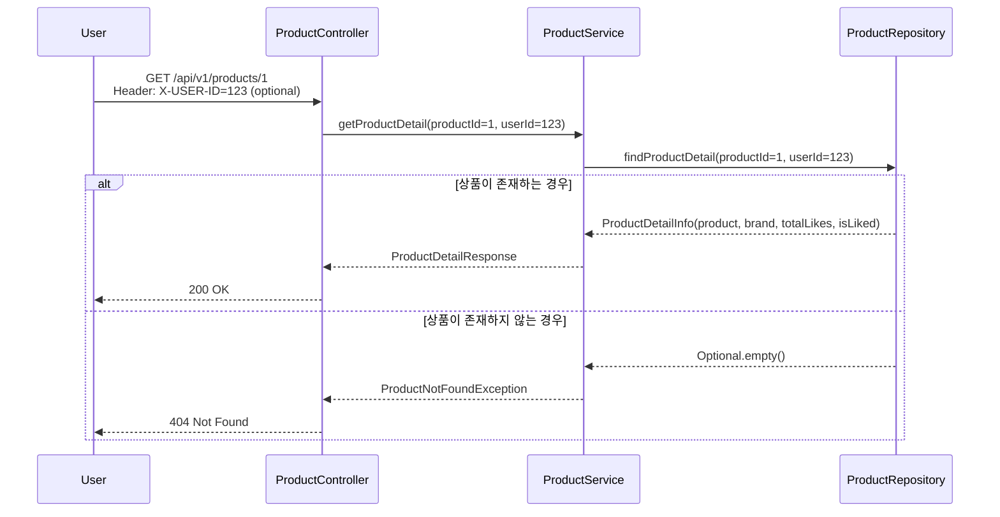

## 3. 브랜드 목록 조회

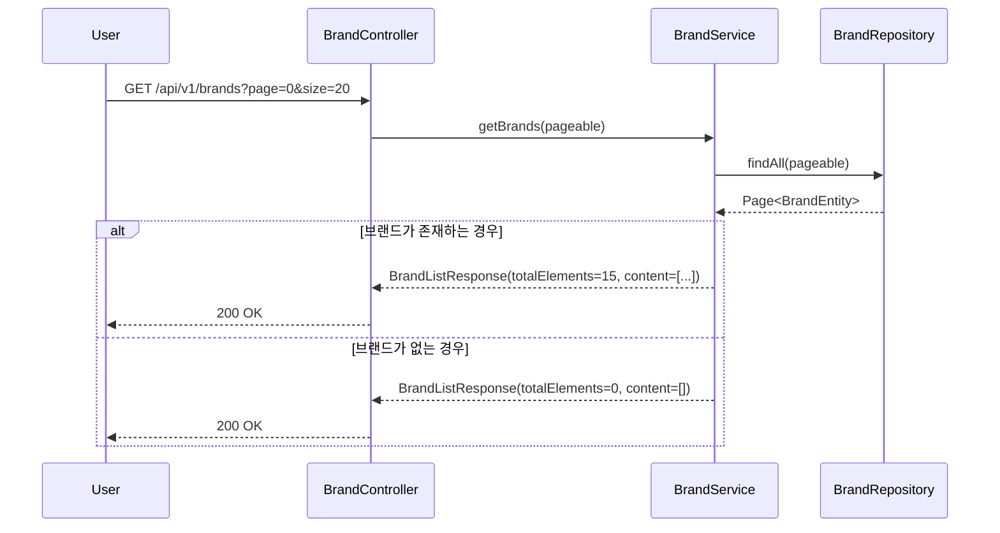

## 4. 브랜드 상세 조회

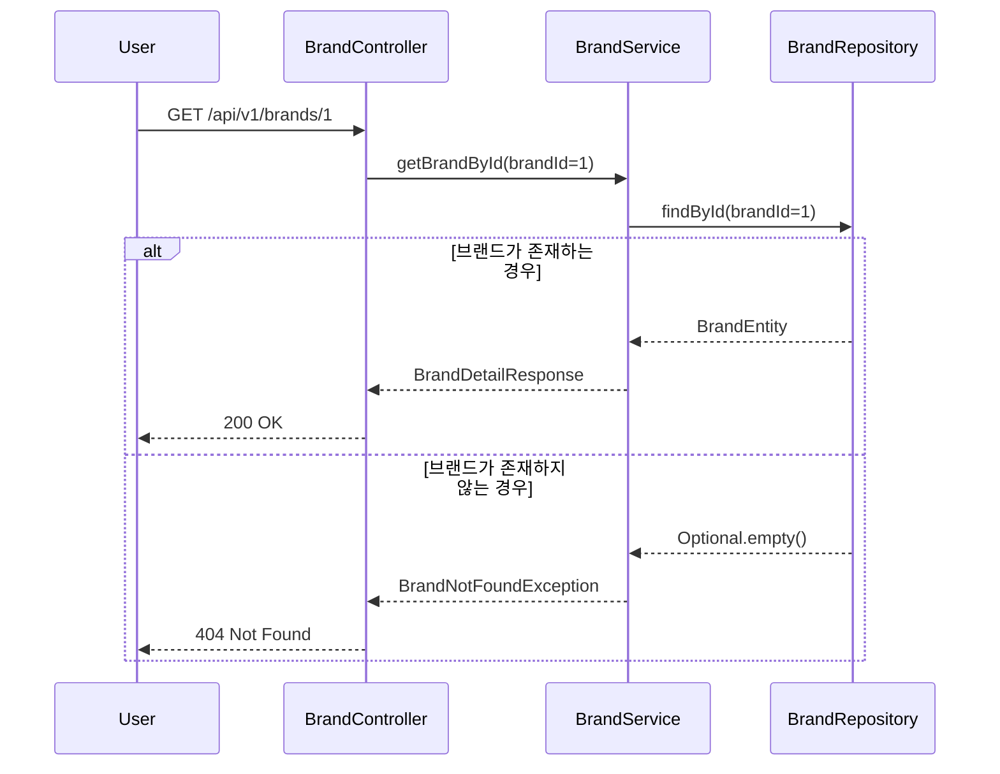

## 5. 좋아요 등록

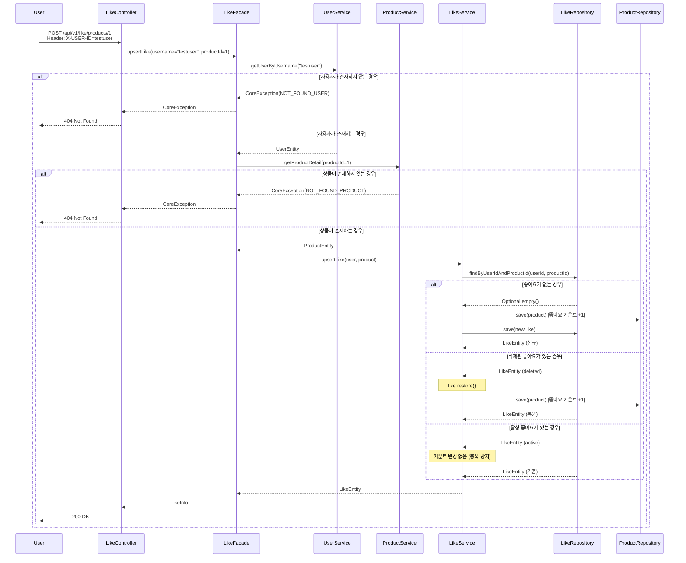

## 6. 좋아요 취소

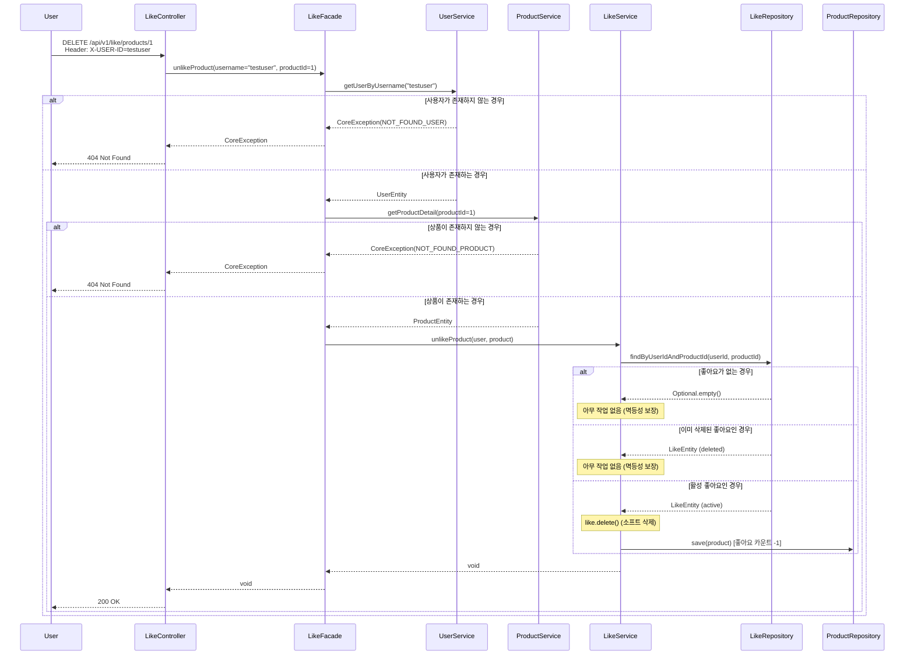

## 7. 포인트 충전

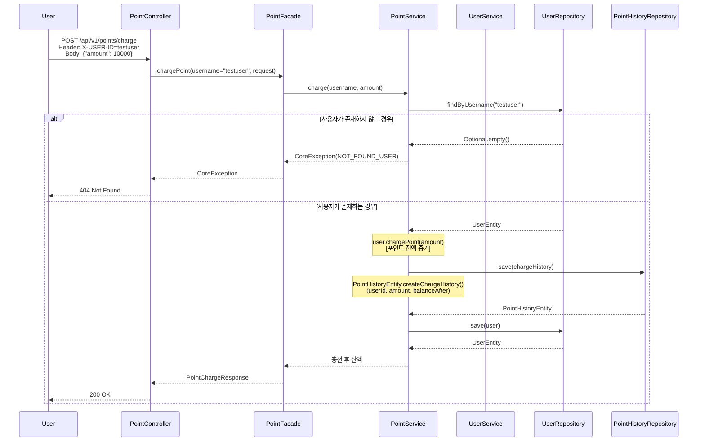

## 8. 포인트 조회

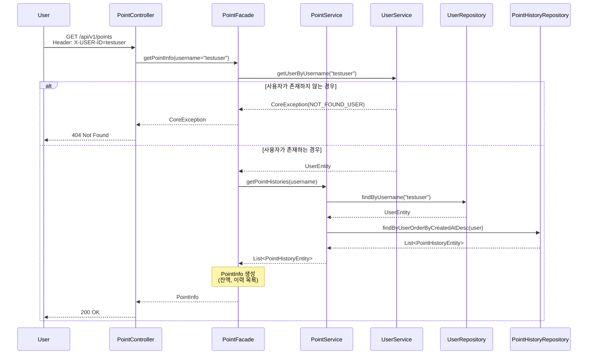

## 10. 주문 요청

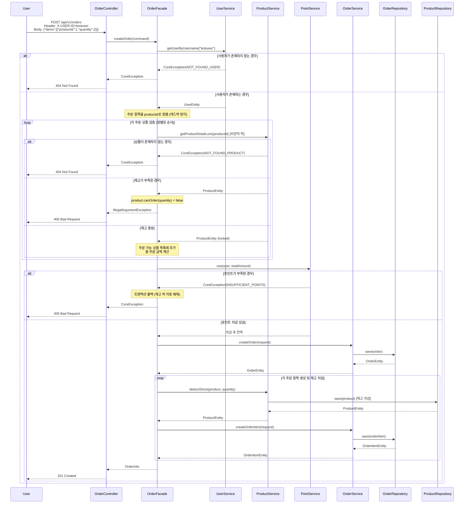

### 🔒 주문 처리 원자성 보장

#### **트랜잭션 전략**
- **@Transactional 기반 원자성**: OrderFacade의 createOrder 메서드 전체가 하나의 트랜잭션
  - 모든 작업이 성공하면 커밋
  - 중간에 예외 발생 시 자동 롤백 (재고 락 해제, 포인트 복구, 주문 취소)
  
#### **데드락 방지 전략**
- **정렬된 락 획득**: 주문 항목을 productId 기준으로 정렬하여 처리
  - 스레드 A: [상품1, 상품2] 순서로 락 획득
  - 스레드 B: [상품1, 상품2] 순서로 락 획득 (동일 순서)
  - 결과: 원형 대기(circular wait) 방지
  
#### **동시성 제어**
- **비관적 락(Pessimistic Lock)**: getProductDetailLock()에서 SELECT ... FOR UPDATE 사용
  - 재고 조회 시점에 행 레벨 락 획득
  - 트랜잭션 종료 시까지 다른 트랜잭션의 접근 차단

## 11. 사용자의 주문 목록 조회

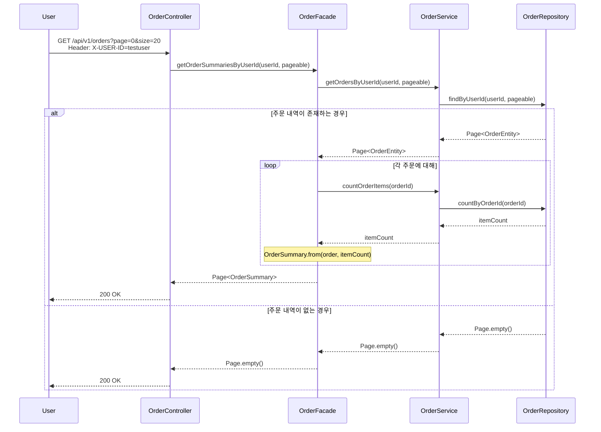

## 12. 주문 상세 조회

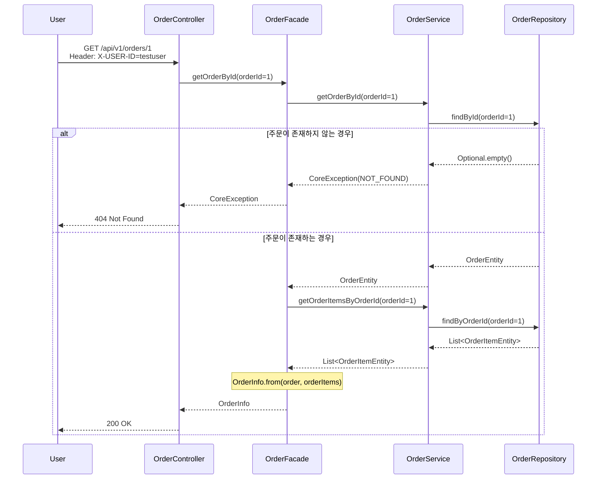

## 13. 주문 취소

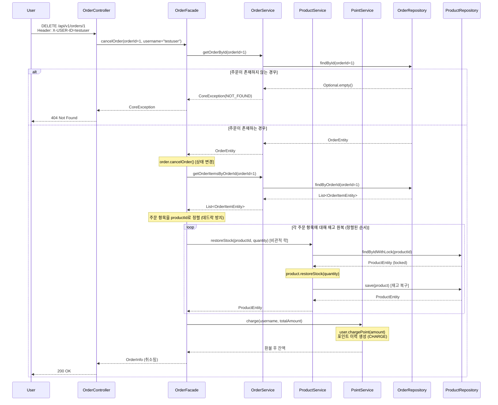

### 🔒 주문 취소 원자성 보장

#### **트랜잭션 전략**
- **@Transactional 기반 원자성**: OrderFacade의 cancelOrder 메서드 전체가 하나의 트랜잭션
  - 주문 상태 변경, 재고 복구, 포인트 환불이 모두 성공하면 커밋
  - 중간에 예외 발생 시 자동 롤백
  
#### **데드락 방지 전략**
- **정렬된 락 획득**: 주문 항목을 productId 기준으로 정렬하여 재고 복구
  - 주문 생성 시와 동일한 순서로 락 획득
  - 원형 대기(circular wait) 방지
