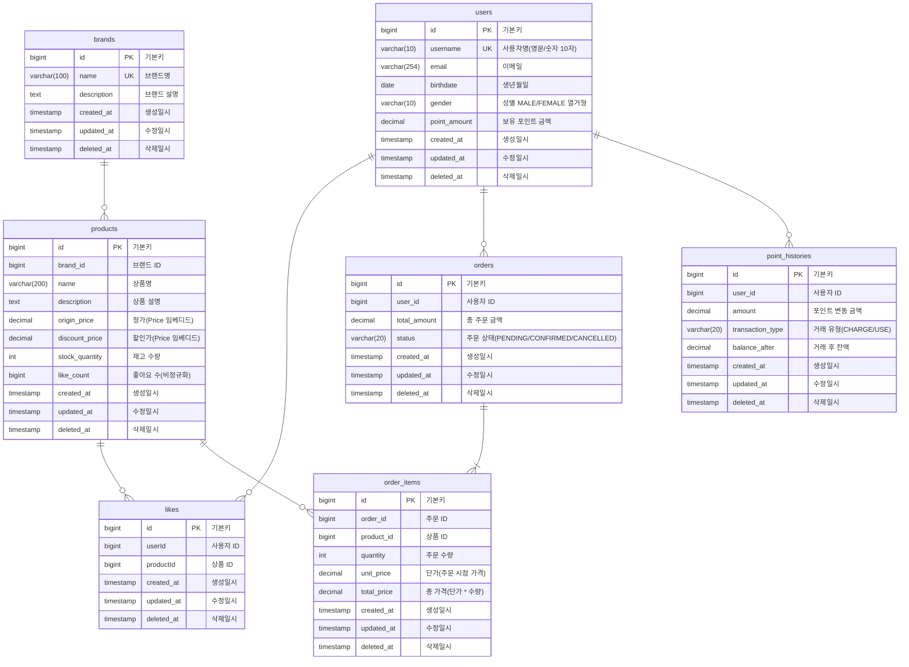

# 04. ERD

## 개요

이커머스 서비스의 데이터베이스 ERD 입니다. 

---

## 전체 ERD



---

## 테이블별 상세 설명

### 1. users (사용자)

**목적**: 이커머스 서비스를 이용하는 사용자 정보 관리

| 컬럼명 | 타입 | 제약조건 | 설명 |
|--------|------|----------|------|
| id | BIGINT | PK, AUTO_INCREMENT | 사용자 고유 식별자 |
| username | VARCHAR(10) | UNIQUE, NOT NULL | 사용자명 (영문/숫자 10자 이내) |
| email | VARCHAR(254) | NOT NULL | 이메일 주소 |
| birthdate | DATE | NOT NULL | 생년월일 |
| gender | VARCHAR(10) | NOT NULL | 성별 (MALE/FEMALE) |
| point_amount | DECIMAL(9,2) | NOT NULL, DEFAULT 0 | 포인트 잔액 (음수 불가) |
| created_at | TIMESTAMP | NOT NULL | 생성일시 |
| updated_at | TIMESTAMP | NOT NULL | 수정일시 |
| deleted_at | TIMESTAMP | NULL | 삭제일시|

**인덱스**:
- `idx_user_username`: username (유니크 인덱스)

**비즈니스 규칙**:
- 포인트는 항상 0 이상이어야 함
- 포인트 차감 시 잔액 검증 필수
- 사용자명은 중복 불가

---

### 2. brands (브랜드)

**목적**: 상품을 그룹화하는 브랜드 정보 관리

| 컬럼명 | 타입 | 제약조건 | 설명         |
|--------|------|----------|------------|
| id | BIGINT | PK, AUTO_INCREMENT | 브랜드 고유 식별자 |
| name | VARCHAR(100) | UNIQUE, NOT NULL | 브랜드명       |
| description | TEXT | NULL | 브랜드 설명     |
| created_at | TIMESTAMP | NOT NULL | 생성일시       |
| updated_at | TIMESTAMP | NOT NULL | 수정일시       |
| deleted_at | TIMESTAMP | NULL | 삭제일시       |

**인덱스**:
- `idx_brand_name`: name (유니크 인덱스)

**비즈니스 규칙**:
- 브랜드명은 중복 불가

---

### 3. products (상품)

**목적**: 판매 가능한 상품 정보 관리

| 컬럼명 | 타입 | 제약조건 | 설명            |
|--------|------|----------|---------------|
| id | BIGINT | PK, AUTO_INCREMENT | 상품 고유 식별자     |
| brand_id | BIGINT | NOT NULL | 브랜드 ID (brands.id) |
| name | VARCHAR(200) | NOT NULL | 상품명           |
| description | TEXT | NULL | 상품 설명         |
| origin_price | DECIMAL(10,2) | NOT NULL | 정가 (Price 임베디드 타입)            |
| discount_price | DECIMAL(10,2) | NULL | 할인가 (Price 임베디드 타입, 선택사항)   |
| stock_quantity | INT | NOT NULL, DEFAULT 0 | 재고 수량 (음수 불가) |
| like_count | BIGINT | NOT NULL, DEFAULT 0 | 좋아요 수  |
| created_at | TIMESTAMP | NOT NULL | 생성일시          |
| updated_at | TIMESTAMP | NOT NULL | 수정일시          |
| deleted_at | TIMESTAMP | NULL | 삭제일시|

**인덱스**:
- `idx_productentity_brand_id`: brand_id (브랜드별 상품 조회)
- `idx_productentity_name`: name (상품명 검색)

**임베디드 타입 (Price)**:
```java
@Embeddable
public class Price {
    private BigDecimal originPrice;  // 정가
    private BigDecimal discountPrice; // 할인가 (선택사항)
    
    // 실제 판매가 반환 (할인가가 있으면 할인가, 없으면 정가)
    public BigDecimal getSellingPrice()
}
```

**비즈니스 규칙**:
- 재고는 항상 0 이상이어야 함
- 재고 차감 시 가용 수량 검증 필수
- 할인가는 선택사항이며, 설정 시 정가보다 작아야 함
- Price는 임베디드 타입으로 정가와 할인가를 함께 관리
- released_at 필드는 엔티티에서 제거됨 (비즈니스 요구사항 변경)

---

### 4. likes (좋아요)

**목적**: 사용자의 상품 좋아요 정보 관리

| 컬럼명 | 타입 | 제약조건 | 설명 |
|--------|------|----------|------|
| id | BIGINT | PK, AUTO_INCREMENT | 좋아요 고유 식별자 |
| userId | BIGINT | NOT NULL, UNIQUE (with productId) | 사용자 ID (users.id) |
| productId | BIGINT | NOT NULL, UNIQUE (with userId) | 상품 ID (products.id) |
| created_at | TIMESTAMP | NOT NULL | 좋아요 등록 시간 |
| updated_at | TIMESTAMP | NOT NULL | 수정일시 |
| deleted_at | TIMESTAMP | NULL | 삭제일시|

**인덱스**:
- `uc_likee_user_product`: (userId, productId) UNIQUE (중복 방지)

**논리적 관계** (물리적 FK 없음):
- userId → users(id)
- productId → products(id)

**비즈니스 규칙**:
- 사용자당 상품별 좋아요는 1개만 가능 (복합 고유 제약)
- 좋아요 등록/취소는 멱등성 보장
- 좋아요 등록 시 products.like_count 증가
- 좋아요 취소 시 products.like_count 감소

---

### 5. orders (주문)

**목적**: 사용자의 주문 정보 관리

| 컬럼명 | 타입 | 제약조건 | 설명 |
|--------|------|----------|------|
| id | BIGINT | PK, AUTO_INCREMENT | 주문 고유 식별자 |
| user_id | BIGINT | NOT NULL | 사용자 ID (users.id) |
| total_amount | DECIMAL(10,2) | NOT NULL | 총 주문 금액 |
| status | VARCHAR(20) | NOT NULL | 주문 상태 (PENDING/CONFIRMED/CANCELLED) |
| created_at | TIMESTAMP | NOT NULL | 생성일시 (주문 일시로 사용) |
| updated_at | TIMESTAMP | NOT NULL | 수정일시 |
| deleted_at | TIMESTAMP | NULL | 삭제일시|

**인덱스**:
- `idx_order_user_id`: user_id (사용자별 주문 목록 조회)
- `idx_order_status`: status (상태별 주문 조회)

**논리적 관계** (물리적 FK 없음):
- user_id → users(id)

**비즈니스 규칙**:
- 주문 생성 시 상태는 PENDING
- 결제 완료 시 CONFIRMED로 변경
- PENDING 또는 CONFIRMED 상태에서 CANCELLED로 변경 가능
- total_amount는 order_items의 total_price 합계
- ordered_at 필드는 제거되고 created_at을 주문 일시로 사용

**상태 전이**:
```
PENDING → CONFIRMED (결제 완료)
PENDING → CANCELLED (주문 취소)
CONFIRMED → CANCELLED (주문 취소)
```

---

### 6. order_items (주문 상세)

**목적**: 주문에 포함된 개별 상품 정보 관리

| 컬럼명 | 타입 | 제약조건 | 설명 |
|--------|------|----------|------|
| id | BIGINT | PK, AUTO_INCREMENT | 주문 상세 고유 식별자 |
| order_id | BIGINT | NOT NULL | 주문 ID (orders.id) |
| product_id | BIGINT | NOT NULL | 상품 ID (products.id) |
| quantity | INT | NOT NULL | 주문 수량 (1 이상) |
| unit_price | DECIMAL(10,2) | NOT NULL | 단가 (주문 시점의 상품 가격) |
| total_price | DECIMAL(10,2) | NOT NULL | 총 가격 (unit_price * quantity) |
| created_at | TIMESTAMP | NOT NULL | 생성일시 |
| updated_at | TIMESTAMP | NOT NULL | 수정일시 |
| deleted_at | TIMESTAMP | NULL | 삭제일시|

**인덱스**:
- `idx_order_item_order_id`: order_id (주문별 상세 조회)
- `idx_order_item_product_id`: product_id (상품별 주문 이력)

**논리적 관계** (물리적 FK 없음):
- order_id → orders(id)
- product_id → products(id)

**비즈니스 규칙**:
- quantity는 1 이상이어야 함
- unit_price는 주문 시점의 상품 가격 스냅샷
- total_price = unit_price * quantity
- 주문 생성 시 재고 차감 필수

---

### 7. point_histories (포인트 이력)

**목적**: 사용자의 포인트 변동 이력 관리 (감사 추적)

| 컬럼명 | 타입 | 제약조건 | 설명 |
|--------|------|----------|------|
| id | BIGINT | PK, AUTO_INCREMENT | 포인트 이력 고유 식별자 |
| user_id | BIGINT | NOT NULL (FK) | 사용자 ID (users.id) - ManyToOne 관계 |
| amount | DECIMAL(9,2) | NOT NULL | 포인트 변동 금액 (항상 양수) |
| transaction_type | VARCHAR(20) | NOT NULL | 거래 유형 (CHARGE/USE/REFUND) |
| balance_after | DECIMAL(9,2) | NOT NULL | 거래 후 잔액 |
| created_at | TIMESTAMP | NOT NULL | 거래 일시 |
| updated_at | TIMESTAMP | NOT NULL | 수정일시 |
| deleted_at | TIMESTAMP | NULL | 삭제일시|

**인덱스**:
- JPA에서 자동 생성되는 FK 인덱스 사용

**물리적 관계**:
- user_id → users(id) - ManyToOne 관계로 물리적 FK 존재

**비즈니스 규칙**:
- 모든 포인트 변동은 이력으로 기록
- amount는 항상 양수 (거래 유형으로 충전/사용 구분)
- balance_after는 거래 후 users.point_amount와 일치
- UserEntity와 ManyToOne 관계로 물리적 FK 존재

**거래 유형**:
- `CHARGE`: 포인트 충전
- `USE`: 포인트 사용 (주문 결제)
- `REFUND`: 포인트 환불 (주문 취소)
---

## 데이터베이스 제약사항

### 1. 외래키 제약조건

**⚠️ 물리적 FK 제약조건 제한적 사용 정책**

이 프로젝트는 **대부분의 테이블에서 물리적 외래키(Foreign Key) 제약조건을 사용하지 않습니다**.

**예외**:
- `point_histories` 테이블의 `user_id`는 JPA `@ManyToOne` 관계로 물리적 FK 존재
  - 포인트 이력은 사용자와 강한 결합 관계
  - 사용자 삭제 시 이력도 함께 관리 필요

**물리적 FK 미사용 이유**:
- **성능**: FK 제약조건은 INSERT/UPDATE/DELETE 시 추가 검증 오버헤드 발생
- **유연성**: 데이터 마이그레이션 및 배치 작업 시 제약 없음
- **확장성**: 샤딩, 파티셔닝 등 분산 환경에서 유리
- **장애 격리**: 참조 테이블 장애 시에도 독립적 운영 가능

---
### 2. 테이블 네이밍 규칙

- 복수형 사용 (users, products, orders)
- 스네이크 케이스 (snake_case)
- 소문자 사용
